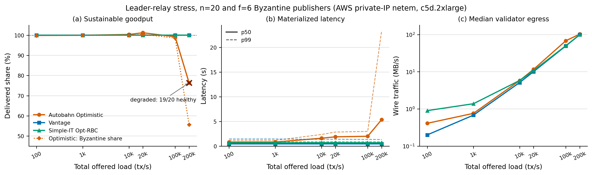

# n=20 leader-relay stress

This record compares Autobahn Optimistic all-to-all, Vantage, and Simple-IT
Opt-RBC under the same leader-relay attack. The committee has `n=20` and
`f=6` Byzantine publishers. Each Byzantine lane sends one batch per
`Delta=200 ms` only to a fixed five-validator correct-holder group; including
the author, this leaves exactly six direct holders, one below the `f+1=7` PoA
threshold. Publishers expose their headers, refuse repair, and receive the
same input share as honest authors.

Each protocol ran on a fresh fleet of 20 `c5d.2xlarge` validators plus one
control instance in `eu-west-1a`. Protocol traffic used private IP addresses
and the AWS RTT matrix through `tc netem` (observed probe range 1.3--309.4 ms).
Transactions were 512 bytes; every point used a 30-second warmup and a
120-second measurement window. The node image was
`ghcr.io/polinikita/vantage-node@sha256:e4bc05f09ee916c4fd77fdc8cb6fec00009e67bcdab50529667f829152db756c`.

## Measurements

Useful TPS excludes Byzantine marker-2 transactions. Optimistic sequences
those transactions normally and reports them separately in the `Byzantine`
column; Vantage and Simple-IT intentionally exclude these sub-PoA lanes.
Latency is materialized p50, and wire traffic is the median per validator.

| offered TPS | Optimistic useful | Optimistic Byzantine | Vantage useful | Simple-IT useful | p50 ms O / V / S | wire MB/s O / V / S |
|---:|---:|---:|---:|---:|---:|---:|
| 100 | 69.9 | 29.9 | 70.0 | 70.0 | 817 / 450 / 671 | 0.41 / 0.20 / 0.90 |
| 1,000 | 699.7 | 300.0 | 700.1 | 699.5 | 823 / 447 / 670 | 0.76 / 0.68 / 1.38 |
| 10,000 | 7,024.1 | 2,997.5 | 6,998.4 | 7,006.0 | 1,594 / 451 / 677 | 5.80 / 5.13 / 5.83 |
| 20,000 | 14,168.9 | 6,026.2 | 14,003.6 | 13,992.7 | 1,879 / 459 / 682 | 11.60 / 10.07 / 10.77 |
| 100,000 | 69,450.8 | 29,582.0 | 69,965.2 | 70,031.4 | 1,990 / 450 / 674 | 68.31 / 49.59 / 50.28 |
| 200,000 | 106,950.2 | 33,331.9 | 139,982.2 | 140,038.2 | 5,350 / 455 / 677 | 103.02 / 99.00 / 99.71 |

## Findings

- Optimistic behaves as intended at low load: it sequences essentially 100%
  of both honest and Byzantine traffic through 100,000 offered TPS.
- At 100,000 TPS, Optimistic uses 38% more median-validator egress than
  Vantage and has 4.4x Vantage's materialized p50 latency, despite all three
  retaining the full useful share.
- At 200,000 TPS, Optimistic's first attempt leaves two replicas stalled. Its
  full-committee retry delivers only 76.4% of reachable honest load and 55.6%
  of the Byzantine share; materialized p50/p99 reaches 5.35/23.35 seconds,
  three queues hit their 1,000-entry caps, and only 19/20 replicas are healthy
  at the final scrape.
- Vantage and Simple-IT deliver the complete 140,000-TPS honest share at the
  same 200,000-TPS offered load while committing none of the sub-PoA
  Byzantine data. Their materialized p50 remains 455 and 677 ms respectively.

The degraded Optimistic 200,000-TPS retry could not read the final netem drop
counter because the overloaded host stopped accepting SSH; all other measured
points report zero netem drops and zero panics. The failed first attempt and
the successful retry diagnostics remain in the ignored raw `results/` tree.

## Artifacts

- `comparison.png` and `comparison.pdf`: paper-ready figure
- `n20-leader-relay-scaling-optimistic/`: Optimistic sweep, effective config,
  and generated summary
- `n20-leader-relay-scaling-vantage/`: isolated Vantage sweep and config
- `n20-leader-relay-scaling-simpleit/`: isolated Simple-IT sweep and config

The full Prometheus archives are not tracked in Git. Their local campaign
directories are named in the sweep records and can be regenerated from
`configs/n20-leader-relay-scaling.yaml`.
